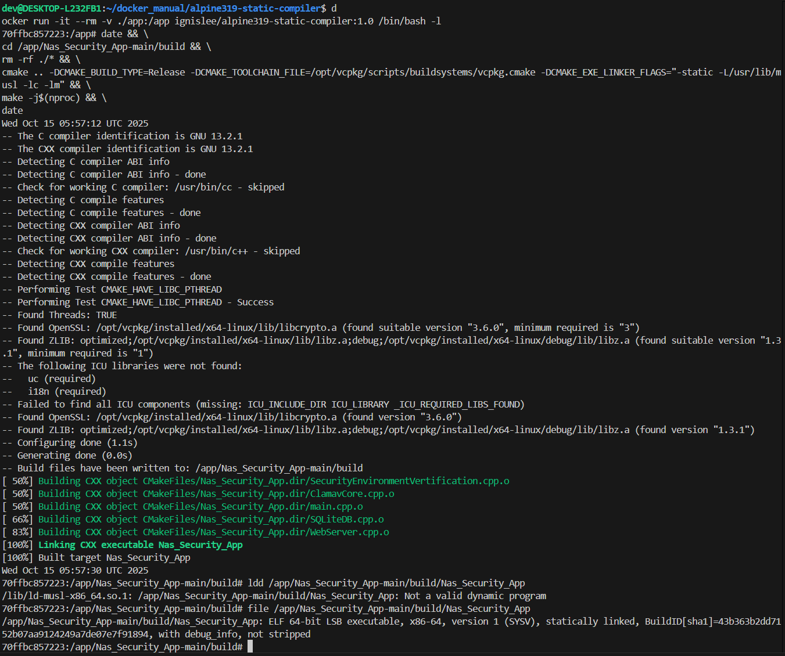

# Nas_Security_App
日本家用nas安全软件

## 后端程序第三方依赖:

本项目新增以下 C/C++ 依赖，用于网络服务、加密通信、数据存储与压缩等基础能力。

- **Crow**：轻量级 C++ Web 框架，用于提供 HTTP/REST 接口与（可选）WebSocket 服务。
- **libcurl (curl)**：HTTP/HTTPS 客户端库，用于向外部服务发起请求。
- **SQLite3**：嵌入式关系型数据库，用于本地持久化存储（无需独立服务）。
- **OpenSSL**：加密与 TLS 支持，为 HTTPS、签名/校验等安全能力提供基础。
- **zlib**：通用压缩库，用于请求/响应与本地数据的压缩/解压。
- **Asio**：异步事件循环与网络 I/O 基础设施，支撑高并发与定时任务。


## 编译指导:

- **编译环境说明:**

  - 基于alpine-3.19做全静态链接程序打包
  - 基于vcpkg来管理第三方静态库的链接
  - 测试在amd64, arm64平台下打包都通过

- **编译环境镜像地址:** https://hub.docker.com/r/ignislee/alpine319-static-compiler

- **一键启动编译环境命令:** 

  - 注意使用1.1tag,不然会有提示icu和i18n库缺失

  - 1.1版本中增加crow框架也到vcpkg中进行管理
  
  - 启动容器命令如下:
  
    `docker run -it --rm -v ./app:/app ignislee/alpine319-static-compiler:1.1 /bin/bash -l`
  
  - 如果想要一键编译执下面个命令(确保终端在项目的根目录下,直接编译完成就自动退出容器):
  
    `docker run --rm -v ./:/app ignislee/alpine319-static-compiler:1.1 sh -c "chmod +x /app/build.sh && /app/build.sh"`

- **增加了一个编译脚本,方便快速编译:**

  - build.sh在源码根目录下,可能需要自己增加可执行权限
  - 会自动把编译完成的可执程序移动到./build目录下
  - debug版本增加了_debug后缀

  ```bash
  Usage: ./build.sh [OPTIONS]
  Options:
    --debug     Build only Debug version
    --release   Build only Release version
    --help, -h  Show this help message
  
  If no options provided, builds both Debug and Release versions
  
  ```

- **debug和release版本编译说明**

  - debug和release版本分别增加了各自场景下的很多参数,具体会产生什么效果需要自测

- **快速启动一个编译用docker容器并完成编译:**

  

以下为之前手动编译的用法,供参考,可以不用这么麻烦了

  ```bash
  # 假设我的源码存在当前目录的./app/Nas_Security_App/下
  
  # 在命令执行目录中存放了源码,会挂载到容器内/app目录下
  # 使用创建好的ignislee/alpine319-static-compiler:1.1镜像
  # 创建了一个退出即销毁的容器
  docker run -it --rm -v ./app:/app ignislee/alpine319-static-compiler:1.1 /bin/bash -l
  
  # 进入了容器内
  # 各种命令集合打包,创建build目录->打印编译开始时间->进入目录->配置cmake->编译->编译->打印编译完成的时间
  # 编译Release版本
  mkdir -p /app/Nas_Security_App/build && \
  date && \
  cd /app/Nas_Security_App/build && \
  rm -rf ./* && \
  cmake .. -DCMAKE_BUILD_TYPE=Release -DCMAKE_TOOLCHAIN_FILE=/opt/vcpkg/scripts/buildsystems/vcpkg.cmake -DCMAKE_EXE_LINKER_FLAGS="-static -L/usr/lib/musl -lc -lm" && \
  make -j$(nproc) && \
  date
  
  # 编译带o3优化的版本
  mkdir -p /app/Nas_Security_App/build && \
  date && \
  cd /app/Nas_Security_App/build && \
  rm -rf ./* && \
  cmake .. \
    -DCMAKE_BUILD_TYPE=Release \
    -DCMAKE_TOOLCHAIN_FILE=/opt/vcpkg/scripts/buildsystems/vcpkg.cmake \
    -DCMAKE_EXE_LINKER_FLAGS="-static -L/usr/lib/musl -lc -lm" \
    -DCMAKE_C_FLAGS_RELEASE="-O3" \
    -DCMAKE_CXX_FLAGS_RELEASE="-O3" && \
  make -j$(nproc) && \
  date
  
  # 编译成功不报错的话会收到类似这样的信息
  ......
  -- Build files have been written to: /app/Nas_Security_App/build
  [ 50%] Building CXX object CMakeFiles/Nas_Security_App.dir/SecurityEnvironmentVertification.cpp.o
  [ 50%] Building CXX object CMakeFiles/Nas_Security_App.dir/ClamavCore.cpp.o
  [ 50%] Building CXX object CMakeFiles/Nas_Security_App.dir/main.cpp.o
  [ 66%] Building CXX object CMakeFiles/Nas_Security_App.dir/SQLiteDB.cpp.o
  [ 83%] Building CXX object CMakeFiles/Nas_Security_App.dir/WebServer.cpp.o
  [100%] Linking CXX executable Nas_Security_App
  [100%] Built target Nas_Security_App
  Wed Oct 15 05:57:30 UTC 2025
  ......
  
  # 进入了容器内
  # 各种命令集合打包,创建build目录->打印编译开始时间->进入目录->配置cmake->编译->编译->打印编译完成的时间
  # 编译Debug版本
  mkdir -p /app/Nas_Security_App/build && \
  date && \
  cd /app/Nas_Security_App/build && \
  rm -rf ./* && \
  cmake .. -DCMAKE_BUILD_TYPE=Debug -DCMAKE_TOOLCHAIN_FILE=/opt/vcpkg/scripts/buildsystems/vcpkg.cmake -DCMAKE_EXE_LINKER_FLAGS="-static -L/usr/lib/musl -lc -lm" && \
  make -j$(nproc) && \
  date
  
  # 检查是否为全静态链接
  ldd /app/Nas_Security_App/build/Nas_Security_App
  # 会收到类似这样的提示
  70ffbc857223:/app/Nas_Security_App/build# ldd /app/Nas_Security_App/build/Nas_Security_App
  /lib/ld-musl-x86_64.so.1: /app/Nas_Security_App/build/Nas_Security_App: Not a valid dynamic program
  
  file /app/Nas_Security_App/build/Nas_Security_App
  # 会收到类似这样的提示
  70ffbc857223:/app/Nas_Security_App/build# file /app/Nas_Security_App/build/Nas_Security_App 
  /app/Nas_Security_App/build/Nas_Security_App: ELF 64-bit LSB executable, x86-64, version 1 (SYSV), statically linked, BuildID[sha1]=43b363b2dd7152b07aa9124249a7de07e7f91894, with debug_info, not stripped
  # 收到这样的说明是一个完全基于静态库的编译
  ```


## 程序发布打包说明(待补充):

- **程序docker镜像打包说明:**
  - 基于Wolfi Static做程序发布,这个不带shell,可免费商用
  - 如需简单调试,使用Alpine或者BusyBox-musl均可


## 程序调用说明(待补充-张应有):


